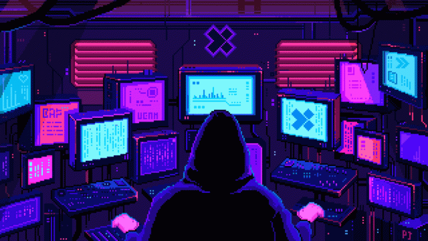
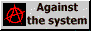

i use [arch](https://archlinux.org/) btw

<b>
    contribution <a href="stats.md">statistics</a> |
    <a href="https://github.com/mb6ockatf/dotfiles">dotfiles</a> |
    <a href="languages.md">languages</a> |
    <a href="https://gist.github.com/mb6ockatf">gists</a>
</b>

checkout my tasks solutions page:

------

[![monkeytype.badge]](https://monkeytype.com/)

[monkeytype.badge]: https://img.shields.io/endpoint?style=flat&url=https%3A%2F%2Fmonkeytype-badge-vhd5lan7mmhz.runkit.sh%3Fmessage%3D48wpm%26label%3Dmonkeytype%26logoVariant%3Done

